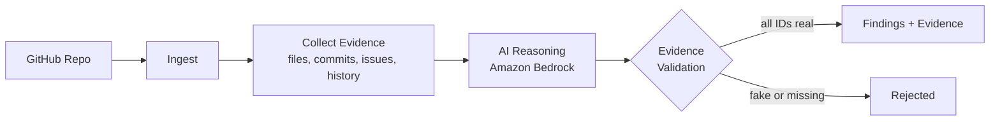
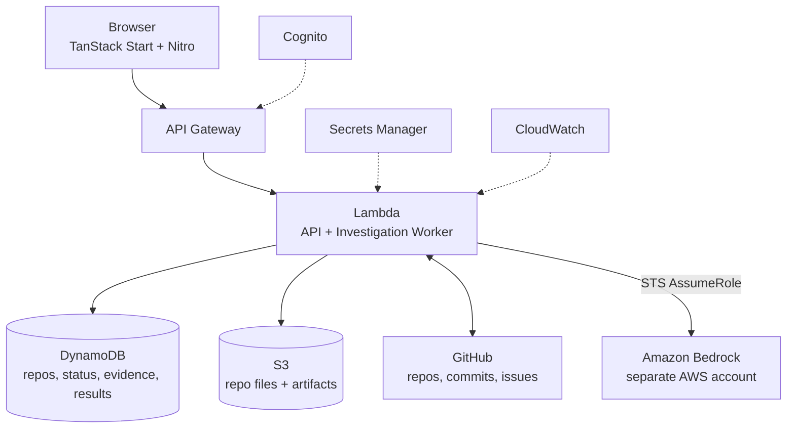
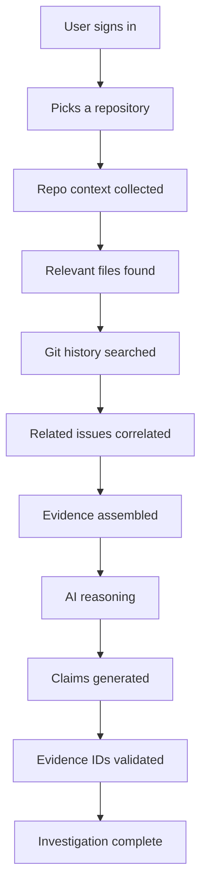

<div align="center">

```text
 ____                  ____  _               _            _
|  _ \ ___ _ __   ___ / ___|| |__   ___ _ __| | ___   ___| | __
| |_) / _ \ '_ \ / _ \\___ \| '_ \ / _ \ '__| |/ _ \ / __| |/ /
|  _ <  __/ |_) | (_) |___) | | | |  __/ |  | | (_) | (__|   <
|_| \_\___| .__/ \___/|____/|_| |_|\___|_|  |_|\___/ \___|_|\_\
          |_|
```

### Ask AI to investigate your repo. Make it show its receipts.


[](https://github.com/harshil6-lab/WeMakeDevs_RepoShareLock)
[](https://app.eraser.io/workspace/lcsAKwSeULmyMChXCPqP?origin=share)
[](https://github.com/harshil6-lab/WeMakeDevs_RepoShareLock/stargazers)
[](https://github.com/harshil6-lab/WeMakeDevs_RepoShareLock/network/members)
[](https://github.com/harshil6-lab/WeMakeDevs_RepoShareLock/issues)
[](https://github.com/harshil6-lab/WeMakeDevs_RepoShareLock/commits)

**Investigate. Correlate. Explain. With evidence.**

</div>

---

## The 10-second pitch

You just joined a huge repo. Auth broke after the last release. Nobody remembers why.

Most AI tools will happily give you a confident paragraph. Maybe it's right. Maybe it invented a file path and a commit SHA that sound very believable.

**RepoSherlock does it differently.** It digs through code, commits, issues, and history, collects real evidence, and only then lets the AI form conclusions. Every claim points at proof you can click and verify. If the proof doesn't exist, the claim doesn't ship.

> [!IMPORTANT]
> **No evidence, no claim.** That one rule is the whole product.

```text
      Typical AI                              RepoSherlock

     .-~~~~~-.                                .-~~~~~-.
    /  O   O  \    "The bug is in            /  o   o  \    "Exhibit A: auth.ts
   |    ___    |    src/utils/magic.ts        |    ^    |     Exhibit B: commit 7e31
    \  \___/  /     line 42, trust me."       \  ---  /      Exhibit C: issue #73"
     '-.___.-'                                 '-.___.-'
     ( confident,                              ( slightly smug,
       file does not exist )                     everything checks out )
```

---

## Explore the project

<div align="center">

| | Link |
|---|---|
| Source code | [github.com/harshil6-lab/WeMakeDevs_RepoShareLock](https://github.com/harshil6-lab/WeMakeDevs_RepoShareLock) |
| Design canvas | [Eraser workspace](https://app.eraser.io/workspace/lcsAKwSeULmyMChXCPqP?origin=share) |

</div>

### The Eraser canvas: the whole system on one board

Everything you'd normally hunt across five docs lives in one place.

| Inside the canvas | What you'll find |
|---|---|
| API schemas | Every endpoint with its request and response shape |
| AWS architecture | API Gateway, Lambda, S3, DynamoDB, Bedrock, Cognito, Secrets Manager, CloudWatch |
| System design | How the pieces fit together and why |
| Pipeline | The investigation flow from GitHub repo to validated findings |
| Sequence diagram | Who calls whom, and in what order, during an investigation |
| ERD | The DynamoDB data model: repositories, investigations, evidence, results |

[](https://app.eraser.io/workspace/lcsAKwSeULmyMChXCPqP?origin=share)

### Jump straight to the good parts

| Where | Link |
|---|---|
| Repository home | [https://github.com/harshil6-lab/WeMakeDevs_RepoShareLock](https://github.com/harshil6-lab/WeMakeDevs_RepoShareLock) |
| Source tree | [https://github.com/harshil6-lab/WeMakeDevs_RepoShareLock/tree/main](https://github.com/harshil6-lab/WeMakeDevs_RepoShareLock/tree/main) |
| Commit history | [https://github.com/harshil6-lab/WeMakeDevs_RepoShareLock/commits](https://github.com/harshil6-lab/WeMakeDevs_RepoShareLock/commits) |
| Open issues | [https://github.com/harshil6-lab/WeMakeDevs_RepoShareLock/issues](https://github.com/harshil6-lab/WeMakeDevs_RepoShareLock/issues) |
| Pull requests | [https://github.com/harshil6-lab/WeMakeDevs_RepoShareLock/pulls](https://github.com/harshil6-lab/WeMakeDevs_RepoShareLock/pulls) |
| Releases | [https://github.com/harshil6-lab/WeMakeDevs_RepoShareLock/releases](https://github.com/harshil6-lab/WeMakeDevs_RepoShareLock/releases) |
| Contributors | [https://github.com/harshil6-lab/WeMakeDevs_RepoShareLock/graphs/contributors](https://github.com/harshil6-lab/WeMakeDevs_RepoShareLock/graphs/contributors) |
| Live in the browser editor | [github.dev/harshil6-lab/WeMakeDevs_RepoShareLock](https://github.dev/harshil6-lab/WeMakeDevs_RepoShareLock) |
| Launch a Codespace | [codespaces.new/harshil6-lab/WeMakeDevs_RepoShareLock](https://codespaces.new/harshil6-lab/WeMakeDevs_RepoShareLock) |

---

## Chatbot vs. Detective

| | Typical AI chat | RepoSherlock |
|---|---|---|
| Question it answers | "What's going on in this repo?" | "What happened, why, what proves it, and how sure are we?" |
| Where facts come from | Whatever the model remembers or guesses | Real files, commits, and issues fetched from GitHub |
| Can it invent a commit SHA? | Absolutely | Rejected by the validator |
| Can you check its work? | Trust me, bro | Every claim links to evidence IDs |
| Output | A wall of text | Structured, inspectable findings |

---

## How an investigation works



The claim format is deliberately boring, so it can be checked by a machine:

```json
{
  "claims": [
    {
      "text": "The authentication middleware was changed during the migration.",
      "evidenceIds": ["ev_001", "ev_004", "ev_007"]
    }
  ]
}
```

Every `evidenceId` is resolved against real collected evidence before you ever see the result.

### What the validator blocks

- Fabricated file paths
- Fabricated commit SHAs
- Fabricated issue numbers
- Evidence IDs that resolve to nothing
- Claims with no supporting evidence
- Malformed investigation output

---

## Meet the detective's toolkit

The AI doesn't get to freestyle. It works through a fixed set of tools, using Bedrock's Converse API and tool calling.

| Tool | What it does |
|---|---|
| `search_repository` | Finds relevant files and code |
| `read_file` | Opens a specific file for a closer look |
| `search_git_history` | Traces how the code evolved |
| `get_commit` | Inspects a single commit and its changes |
| `search_related_issues` | Links code changes to GitHub issues |
| `build_evidence` | Turns raw signals into structured evidence objects |
| `generate_investigation` | Produces the final findings from validated evidence |

### What a claim looks like under the microscope

```text
Claim: "Auth middleware changed during the migration"
  |
  +-- ev_001  ->  src/auth/middleware.ts
  +-- ev_002  ->  commit 7e31...
  +-- ev_003  ->  GitHub issue #73
```

Don't trust the AI. Open the three things it's pointing at.

---

## Architecture

Fully serverless, deployed in **AWS Mumbai (`ap-south-1`)**. Zero servers to babysit.



### The AWS crew

| Service | Job |
|---|---|
| Amazon API Gateway | Front door for every request from the web app |
| AWS Lambda | Runs the APIs, repository ingestion, and the async investigation worker |
| Amazon S3 | Stores repository files and investigation artifacts |
| Amazon DynamoDB | Stores repositories, investigation status, evidence, and final results |
| Amazon Bedrock | AI reasoning (NVIDIA Nemotron Nano) |
| AWS Secrets Manager | Holds GitHub and OAuth credentials |
| Amazon CloudWatch | Logs and monitoring for the whole pipeline |
| Amazon Cognito | Authentication |
| AWS CloudFormation | Infrastructure as code |

### Two AWS accounts, on purpose

The app and the AI runtime live in **separate AWS accounts**. The application Lambda reaches Bedrock by assuming a dedicated role across accounts.

```text
Main RepoSherlock account
   API Gateway, Lambda, Cognito, DynamoDB, S3, CloudFormation
        |
        |  STS AssumeRole
        v
Separate Bedrock account
   RepoSherlockBedrockRole  ->  Amazon Bedrock
```

This keeps the AI runtime isolated from the main application infrastructure.

---

## Security and privacy, the short version

- Server-side authentication with **HTTP-only session cookies**
- Secrets live in **AWS Secrets Manager**, never in the repo and never in frontend bundles
- **No fake logins, no demo accounts, no hardcoded users**
- User identity comes from the **verified auth context**, never from an ID the browser sends
- Repositories and investigations are **scoped per user**, so one user can't read another's
- Cross-account IAM for Bedrock
- Evidence validation on every investigation

```text
Authenticated user
      |
      v
Verified userId
      |
      +-- Repositories
      +-- Investigations
```

Sign in with **GitHub** or **Cognito**.

---

## Tech stack

| Layer | Tools |
|---|---|
| Frontend | TanStack Start, React, TypeScript, Nitro, CSS |
| Backend | AWS Lambda, API Gateway, TypeScript, Node.js |
| Auth | Amazon Cognito, GitHub OAuth |
| Storage | Amazon DynamoDB, Amazon S3 |
| AI | Amazon Bedrock, NVIDIA Nemotron Nano |
| Tooling | GitHub, AWS CloudFormation, AWS CLI, npm |

---

## Quick start

### You need

`Node.js`, `npm`, `AWS CLI`, `Git`, and an AWS profile configured for the RepoSherlock account.

```bash
node --version && npm --version && aws --version && git --version
```

### Get the code (pick your flavor)

| Method | Command or link |
|---|---|
| HTTPS | `git clone https://github.com/harshil6-lab/WeMakeDevs_RepoShareLock.git` |
| SSH | `git clone git@github.com:harshil6-lab/WeMakeDevs_RepoShareLock.git` |
| GitHub CLI | `gh repo clone harshil6-lab/WeMakeDevs_RepoShareLock` |
| Shallow clone (fast, latest snapshot only) | `git clone --depth 1 https://github.com/harshil6-lab/WeMakeDevs_RepoShareLock.git` |
| Download ZIP | [main.zip](https://github.com/harshil6-lab/WeMakeDevs_RepoShareLock/archive/refs/heads/main.zip) |
| Fork it | [Fork on GitHub](https://github.com/harshil6-lab/WeMakeDevs_RepoShareLock/fork) |
| Browser editor, no install | [github.dev](https://github.dev/harshil6-lab/WeMakeDevs_RepoShareLock) |
| Cloud dev environment | [Open in Codespaces](https://codespaces.new/harshil6-lab/WeMakeDevs_RepoShareLock) |

> [!NOTE]
> The ZIP link assumes your default branch is `main`. Swap it if yours differs.

### Run it locally

```bash
git clone https://github.com/harshil6-lab/WeMakeDevs_RepoShareLock.git
cd WeMakeDevs_RepoShareLock
npm install
npm run dev
```

```text
   Developer at 2 AM                     After npm install

     .-------.                            .-------.
     | o   o |   "It works on             | ^   ^ |   "It works on
     |   -   |    my machine."            |   v   |    every machine."
     '-------'                            '-------'
       /| |\                                \| |/
                                        (serverless, so technically no machine)
```

### Check your work

```bash
npm test               # full test suite
npx tsc --noEmit       # type-check
npm run build          # frontend build
npm run build:aws      # Lambda package
```

---

```text
   IAM: "Access Denied."
   You:  "Which action? Which resource?"
   IAM: "Access Denied."

        _____
       /     \
      | () () |      *stares into CloudWatch logs*
       \  ^  /
        |||||
```

## Deploying to AWS

One repeatable PowerShell script handles the whole pipeline.

```text
1. Foundation  ->  2. GitHub secrets  ->  3. Lambda build  ->  4. Upload artifact  ->  5. Application stack
```

```powershell
.\scripts\deploy.ps1 -Region ap-south-1
```

The default profile is `reposherlock`. The CLI targets the main account, and Bedrock stays cross-account.

### Secrets

Credentials stay out of the repo. They live in Secrets Manager:

| Secret | Purpose |
|---|---|
| `reposherlock/github` | GitHub repository access |
| `reposherlock/github-oauth` | GitHub OAuth credentials |

> [!WARNING]
> Never commit secrets to `src/`, `tests/`, `dist/`, `.env`, or this README.

---

## Project structure

```text
RepoSherlock/
├── infrastructure/
│   └── cloudformation/
│       ├── template.yaml
│       └── app.yaml
├── scripts/
│   └── deploy.ps1
├── src/
│   ├── api/
│   ├── auth/
│   ├── components/
│   ├── services/
│   └── aws/
├── tests/
├── public/
├── vite.config.aws.ts
├── package.json
└── README.md
```

---

## The full investigation lifecycle



---

## Example case

> "Why did authentication start failing after the latest release?"

Instead of an hour of grepping, RepoSherlock connects the dots:

```text
GitHub Issue ----+
                 |--> Git History --> Evidence Set --> AI Reasoning --> Investigation
Commit + File ---+
```

You get findings, and every finding comes with the evidence trail that produced it.

---

## When to reach for it

| Situation | What RepoSherlock does |
|---|---|
| Joining an unfamiliar codebase | Gives you a structured starting point instead of a thousand files |
| Debugging a historical problem | Connects bugs to commits, issues, and source changes |
| Code archaeology | Explains why an implementation exists |
| Engineering investigations | Turns scattered signals into structured findings |
| Faster onboarding | Shortens the "where do I even start" phase |

---

## Design philosophy

- **Evidence first.** AI output must connect to observable repository evidence.
- **Deterministic boundaries.** The AI reasons inside controlled application limits.
- **No fabricated evidence.** Unsupported references get rejected.
- **User isolation.** Your data belongs to you.
- **Serverless by default.** Managed services over servers to maintain.
- **Developer experience.** It should feel like a tool developers want to use, not another static AI dashboard.

---

## Why "Sherlock"?

Sherlock never guessed. He found clues, connected them, and explained what happened. RepoSherlock does the same for software.

```text
Code + Git History + Issues + Commits + AI + Evidence  =  Case closed
```

---

## Roadmap

**Shipped**

- [x] GitHub repository investigation
- [x] Repository search and file inspection
- [x] Git history and commit investigation
- [x] Related issue correlation
- [x] Evidence construction and evidence-backed claims
- [x] Structured investigation output
- [x] AWS serverless deployment
- [x] Cognito authentication
- [x] Multi-user authorization boundaries
- [x] Cross-account Bedrock architecture

**Next up**

- [ ] Richer repository relationship graphs
- [ ] Investigation timelines
- [ ] More advanced evidence visualization
- [ ] Deeper architectural analysis
- [ ] Investigation history and comparison
- [ ] More repository providers
- [ ] Advanced developer workflows

---

## Contributing

PRs welcome. Keep changes focused and respect the evidence-integrity model.

```bash
git clone https://github.com/harshil6-lab/WeMakeDevs_RepoShareLock.git
cd WeMakeDevs_RepoShareLock
git checkout -b feature/your-feature

# make your changes, then validate
npm test
npx tsc --noEmit
npm run build
npm run build:aws

git add .
git commit -m "feat: your change"
git push origin feature/your-feature
```

Then open a pull request.

---

## License

Add your project license here.

---

<div align="center">

### Don't just ask AI what happened.
### Ask it to investigate, and make it show the evidence.

```text
        ___________
       /  _     _  \
      |  (o)   (o)  |     "Elementary."
      |     ___     |
       \   \___/   /       Case closed. Evidence attached.
        '-._____.-'
```

**RepoSherlock**
Built for developers who want answers they can actually check.

[Source](https://github.com/harshil6-lab/WeMakeDevs_RepoShareLock) | [Design Canvas](https://app.eraser.io/workspace/lcsAKwSeULmyMChXCPqP?origin=share) | [Issues](https://github.com/harshil6-lab/WeMakeDevs_RepoShareLock/issues) | [Star the repo](https://github.com/harshil6-lab/WeMakeDevs_RepoShareLock)

</div>
