# API flow

## AWS foundation flow

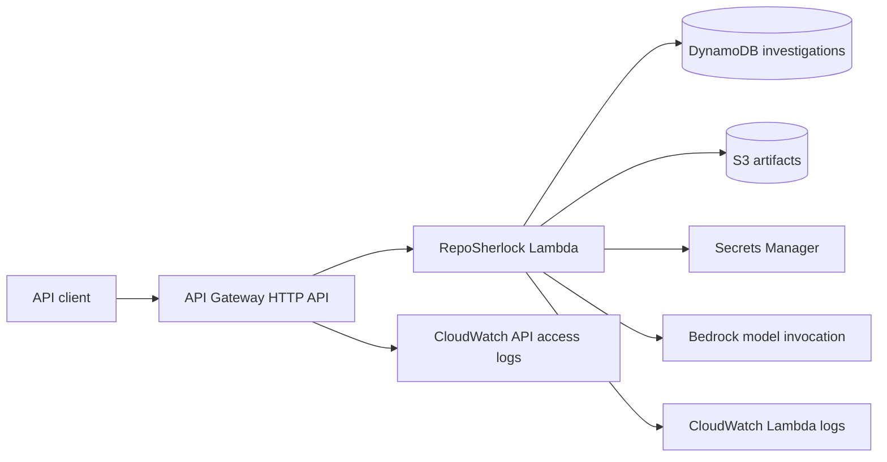

The foundation stack creates the API boundary and the least-privilege execution role. The application stack (Packet 12) attaches the Lambda integration to the same API and puts CloudFront in front of it.

## Storage flow

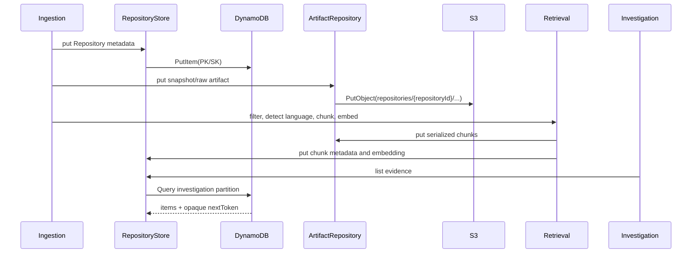

The repository interfaces own key construction, pagination translation, timestamps/status fields, and structured `StorageError` conversion. API handlers do not call DynamoDB or S3.

## GitHub authentication and ingestion flow

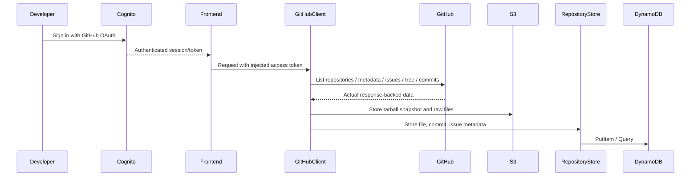

Transient GitHub failures retry within a bounded budget. Rate limits use `Retry-After` or `X-RateLimit-Reset`, capped at 10 seconds per wait. A truncated tree, invalid payload, exhausted retry budget, or unsupported file size fails with a structured error rather than fabricated data.

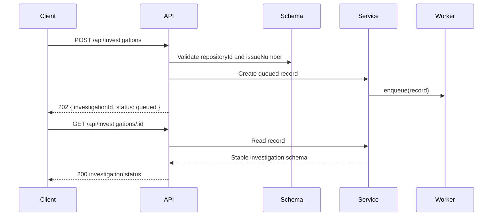

## Repository retrieval flow

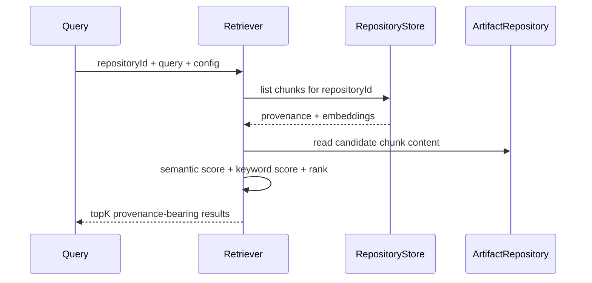

The repository partition is both the storage access pattern and the isolation boundary. Empty queries return no results; thresholding happens before ranking.

## Investigation engine flow

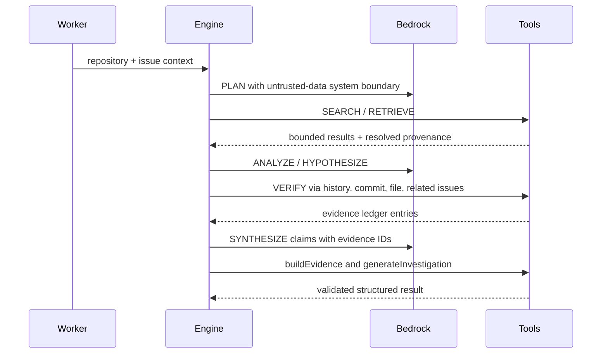

The model never resolves a citation itself. `buildEvidence` resolves only IDs already present in the ledger, and `generateInvestigation` validates every claim before a completed result can be returned. Any limit or dependency failure produces a structured failed result.

## Packet 08 lifecycle

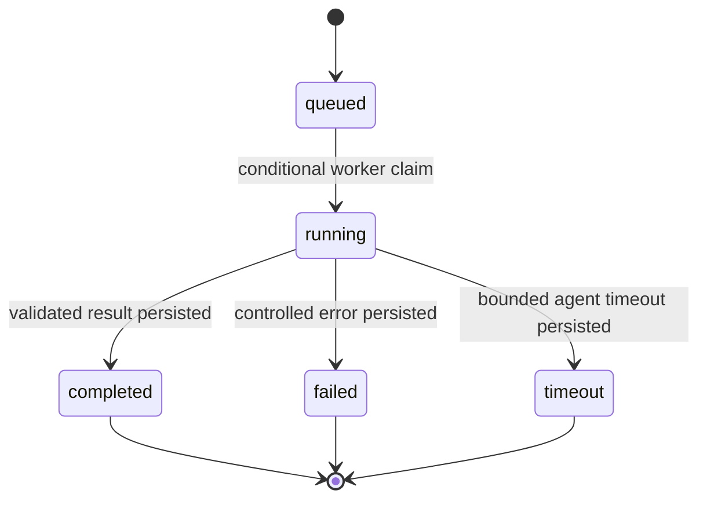

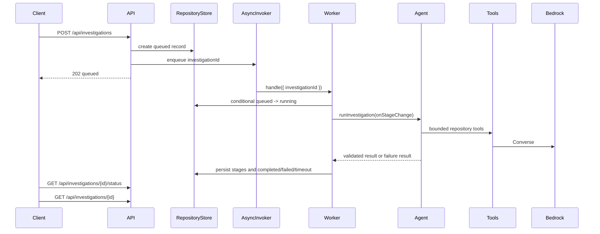

The worker validates repository existence, completed indexing, and issue existence before invoking the agent. It logs structured identifiers and codes only; tokens, credentials, and repository dumps are never logged.

## Packet 09 frontend flow

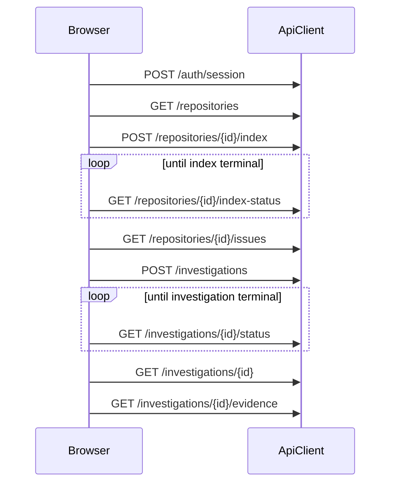

The client validates response shapes and renders loading, empty, network, timeout, and terminal failure states. The main flow never falls back to `mock-data.ts`; mocks remain only as unused demo fixtures.

## Packet 10 golden path

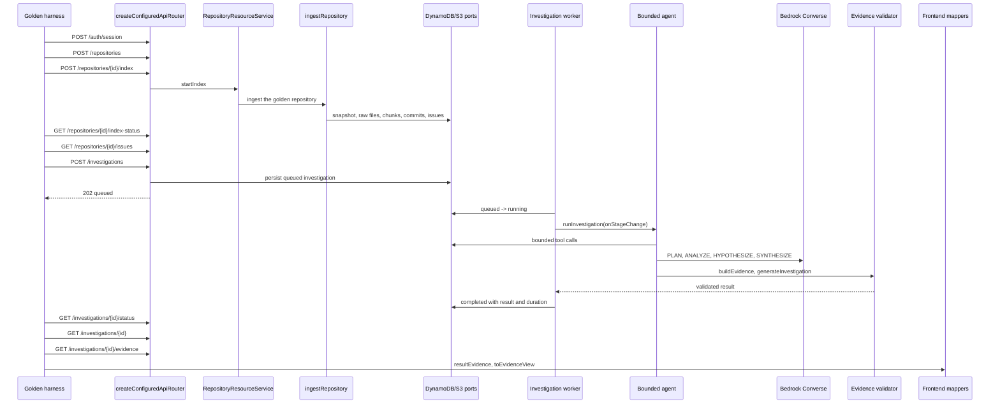

The observed lifecycle is `queued -> running -> completed`. The complete stage order is asserted from structured logs and matches the state machine exactly: `understanding_issue`, `searching_repository`, `tracing_code`, `checking_history`, `finding_related_issues`, `forming_hypothesis`, `verifying_evidence`, `synthesizing`, `validating`, `completed`. The bounded tool sequence for one investigation is `searchRepository`, `readFile`, `searchGitHistory`, `getCommit`, `searchRelatedIssues`, then `buildEvidence` per claim.

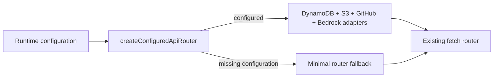

`src/server.ts` resolves the composition root once per process. Missing configuration is a logged warning, never a crash.
## Packet 11 failure and retry flow

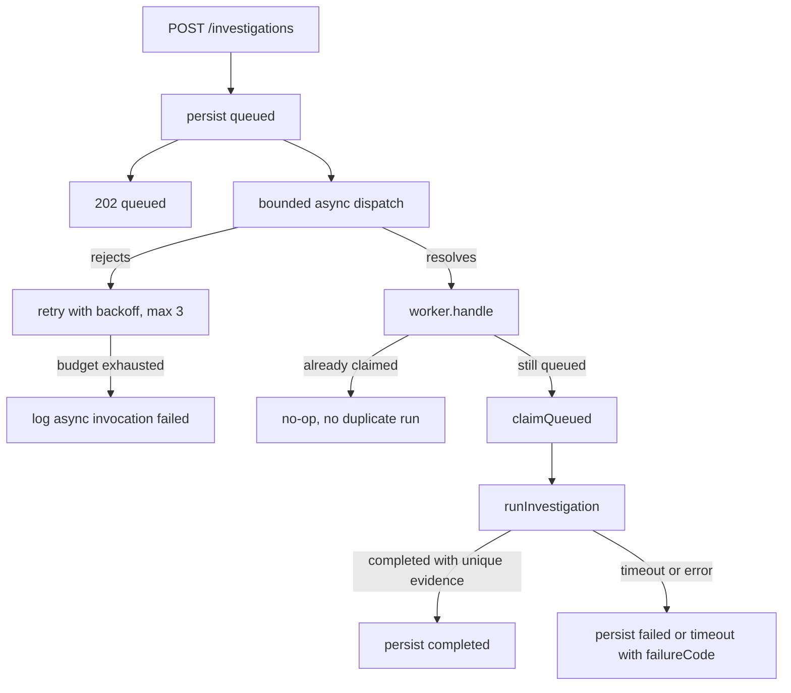

Every external boundary has a controlled outcome: GitHub rate limit (`GITHUB_RATE_LIMITED`), GitHub unavailable (`GITHUB_REQUEST_FAILED`), repository not indexed (`REPOSITORY_NOT_INDEXED`), empty repository (zero files/issues and still `completed`), Bedrock error (`BEDROCK_ERROR`), investigation timeout (`INVESTIGATION_TIMEOUT`), DynamoDB/S3 failures (`StorageError` surfaced as a controlled API 500), and frontend network failure (`ApiClientError` with `NETWORK_ERROR`). Agent bounds always terminate the run: exhausted tool or token budgets, an unresponsive Bedrock call, malformed model JSON, and unresolved or duplicated evidence ids all produce a validated `failed` result instead of an infinite loop or fabricated evidence.

## Packet 12 deployment and request flow

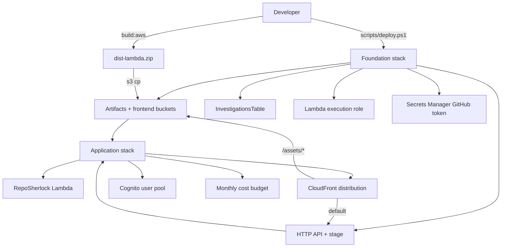

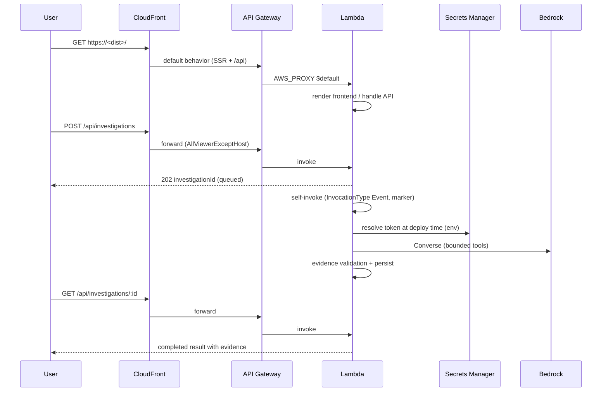

The deployment is two CloudFormation stacks. The foundation stack owns the data, secret, IAM role, HTTP API and log groups; the application stack consumes its outputs and adds the Lambda, the API integration, CloudFront, Cognito and the budget. Data resources are `Retain`-protected, so deleting a stack never destroys the buckets, table or secret.

At runtime CloudFront is the single public entry point. The default behavior proxies `/api/*` and SSR pages to API Gateway → Lambda; `/assets/*` and the static root files are served directly from the S3 frontend bucket through an Origin Access Control. Because the browser calls the relative `/api` base on the CloudFront domain, requests stay same-origin and no wildcard CORS header is emitted.

Long investigations run asynchronously: the API returns `202` with an `investigationId`, then the Lambda self-invokes itself with `InvocationType: "Event"` and the `reposherlock.async` marker. A client that retries the same event cannot start a second run because claiming is conditional on `queued`. The Lambda timeout (300 s) leaves generous headroom over the bounded agent timeout (30 s).

The Bedrock boundary returns plain text: `createBedrockModel` joins every text block of the Converse response (`output.message.content` is an ordered `ContentBlock[]`) instead of only the first, so a reasoning block cannot hide the claims envelope. `parseModelJson` then returns the first JSON candidate that satisfies `claimsSchema`, including JSON nested in object or array string values. A response with no schema-valid object still fails as `INVALID_AGENT_RESULT`; no claim is invented.

## Packet 14 timeout and terminal state

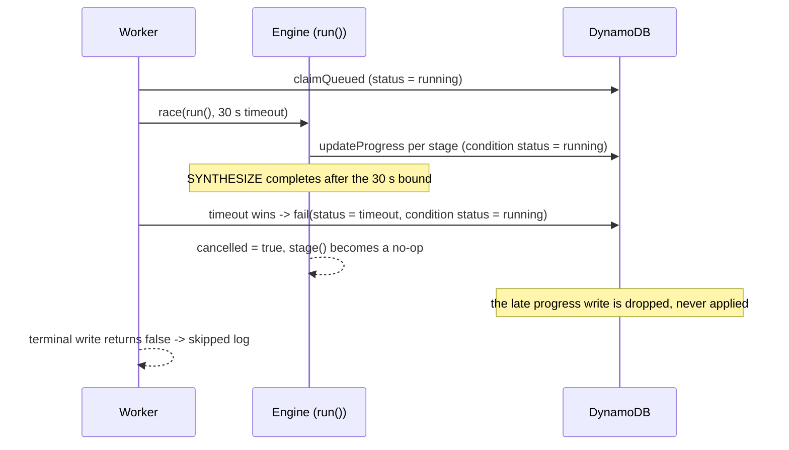

The timeout path only terminates the record while it is still `running`; the abandoned run stops reporting stages once the flag is set, and any write that still loses the condition is dropped at the storage boundary instead of throwing. Exactly one terminal state (`completed`, `failed` or `timeout`) is ever persisted, and the timeout protection is not removed or extended.
