# API flow

## AWS foundation flow

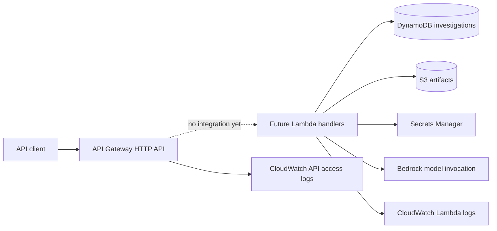

The CloudFormation stack creates the boundary and least-privilege role now. Application integrations remain a later deployment step.

## Storage flow

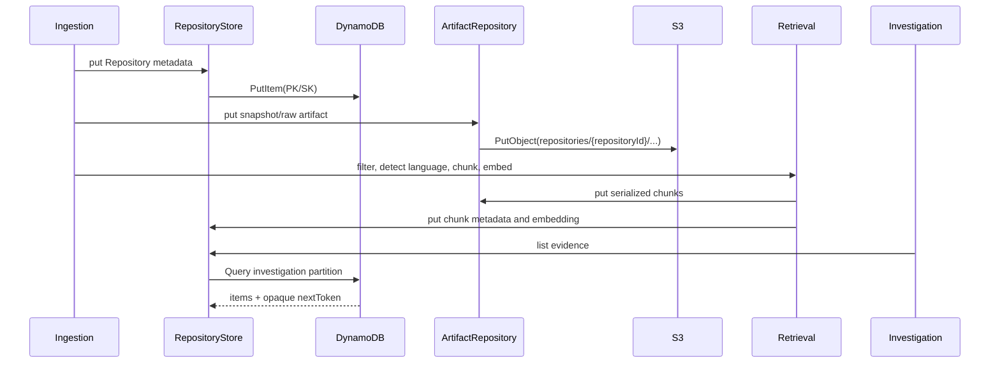

The repository interfaces own key construction, pagination translation, timestamps/status fields, and structured `StorageError` conversion. API handlers do not call DynamoDB or S3.

## GitHub authentication and ingestion flow

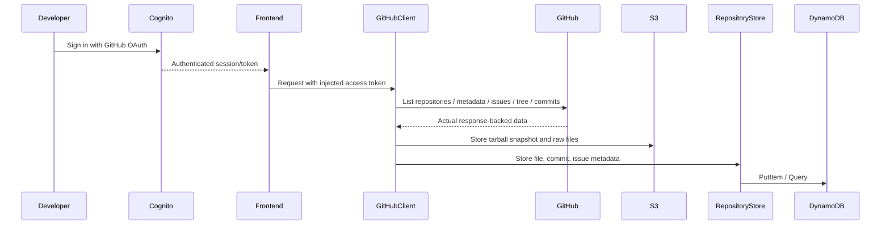

Transient GitHub failures retry within a bounded budget. Rate limits use `Retry-After` or `X-RateLimit-Reset`, capped at 10 seconds per wait. A truncated tree, invalid payload, exhausted retry budget, or unsupported file size fails with a structured error rather than fabricated data.

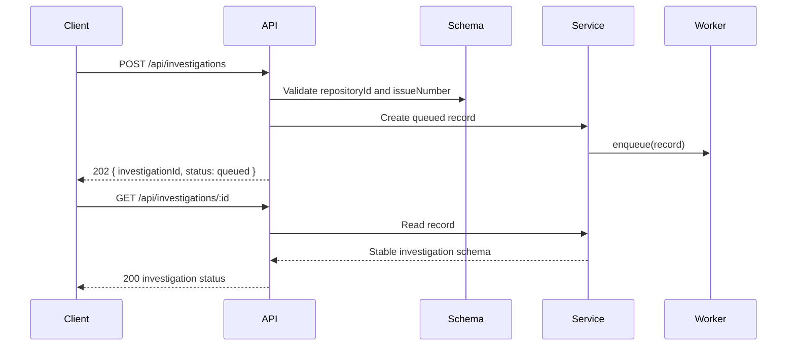

## Repository retrieval flow

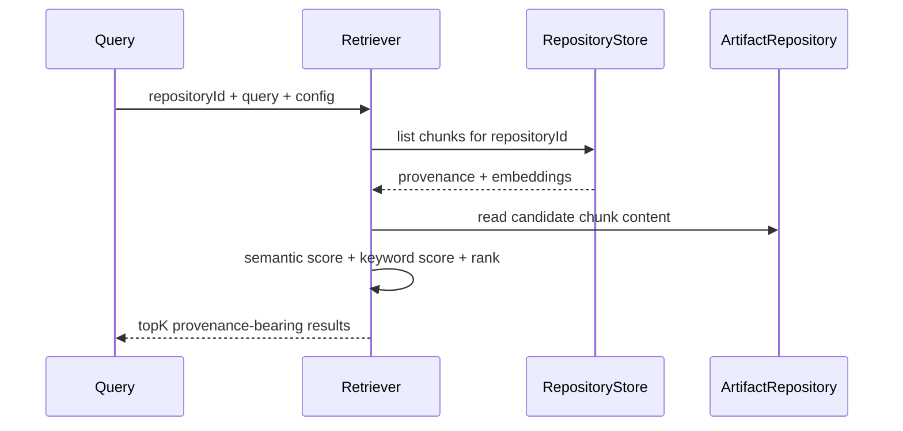

The repository partition is both the storage access pattern and the isolation boundary. Empty queries return no results; thresholding happens before ranking.

## Investigation engine flow

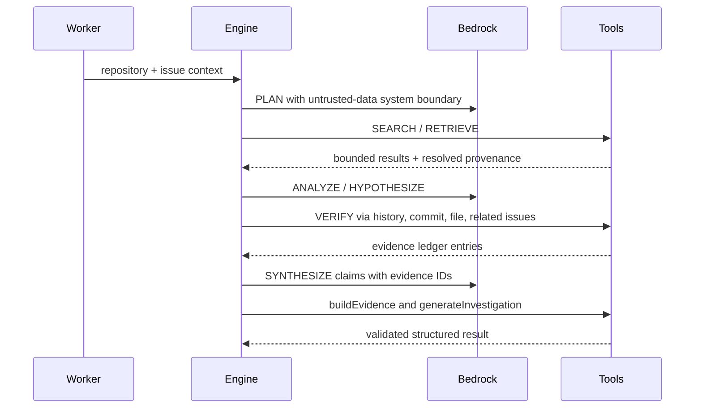

The model never resolves a citation itself. `buildEvidence` resolves only IDs already present in the ledger, and `generateInvestigation` validates every claim before a completed result can be returned. Any limit or dependency failure produces a structured failed result.

## Packet 08 lifecycle

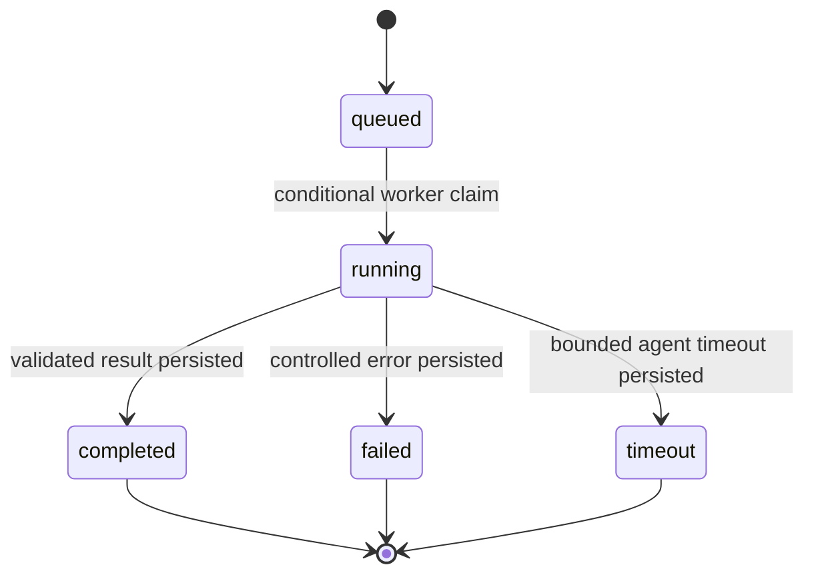

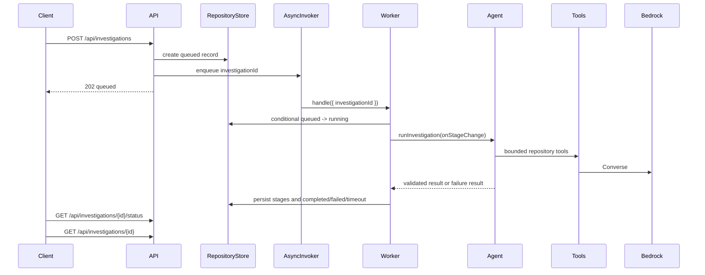

The worker validates repository existence, completed indexing, and issue existence before invoking the agent. It logs structured identifiers and codes only; tokens, credentials, and repository dumps are never logged.

## Packet 09 frontend flow

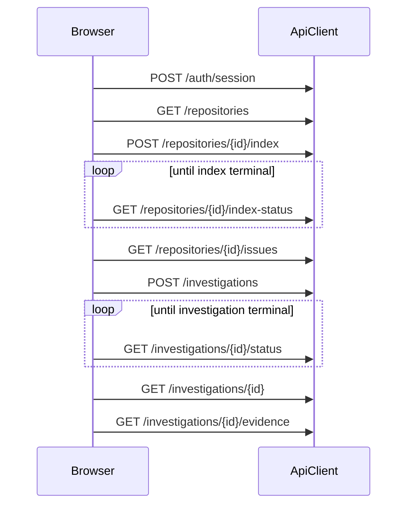

The client validates response shapes and renders loading, empty, network, timeout, and terminal failure states. The main flow never falls back to `mock-data.ts`; mocks remain only as unused demo fixtures.

## Packet 10 golden path

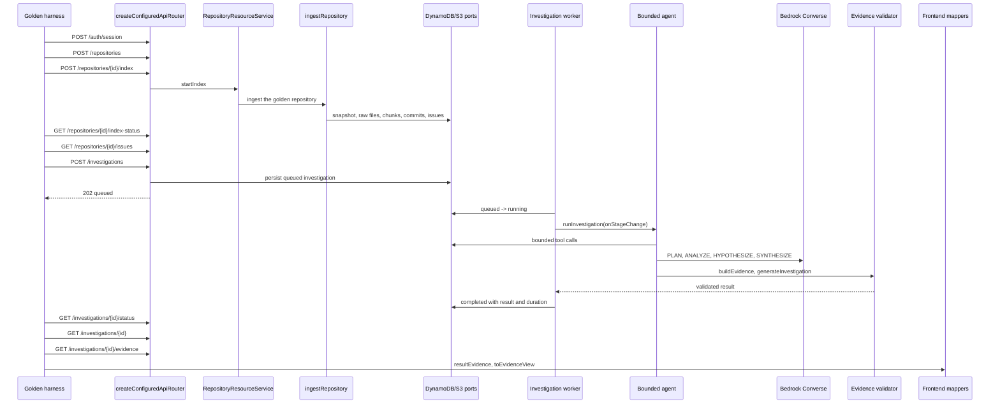

The observed lifecycle is `queued -> running -> completed`. The complete stage order is asserted from structured logs and matches the state machine exactly: `understanding_issue`, `searching_repository`, `tracing_code`, `checking_history`, `finding_related_issues`, `forming_hypothesis`, `verifying_evidence`, `synthesizing`, `validating`, `completed`. The bounded tool sequence for one investigation is `searchRepository`, `readFile`, `searchGitHistory`, `getCommit`, `searchRelatedIssues`, then `buildEvidence` per claim.

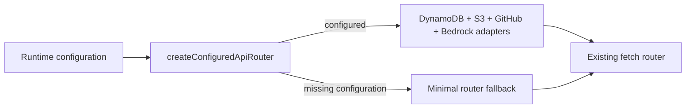

`src/server.ts` resolves the composition root once per process. Missing configuration is a logged warning, never a crash.